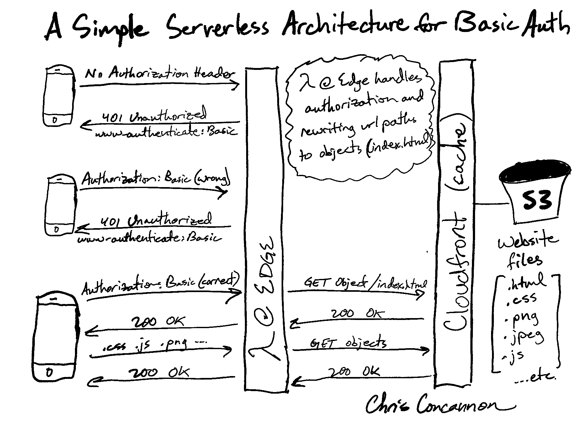

# Password Protect a Static Website

View a working demo that uses these exact files at https://password.concannon.tech

Read a little bit more about this solution at my blog post: https://blog.concannon.tech/tech-talk/basic-password-protection/

Username: `password`
Password: `concannon.tech`

This repo contains code samples and instructions to build a free solution to password-protect a static multi-page website on a custom domain. This uses a single username and password, so it's not a very secure solution to protect valuable information, or to protect anything in the long term. It's more appropriate for use in, for example, an upcoming event website where you don't want any crawlers or scrapers to gather private information about your event.

I used it to password-protect a wedding website that I built so that only the wedding guests would have access to upcoming wedding details.

## Wait, doesn't this already exist?

To my knowledge, no, at least not in a free solution. Netlify and Cloudflare both offer password protection on static site, but you have to pay for it. Netlify currently requires you to be on the $19/mo plan, and Cloudflare charges once your "Team" has over 50 people accessing the site (they authenticate visitors on an email-by-email or social identity basis).

My solution is every bit as scalable and reliable as Cloudflare's and Netlify's, but it's free! Well, it's free until you start getting more than a million requests per month, at which point the costs grow linearly at nickel-by-nickel rates. 

## Prerequisites

This solution uses AWS, so you must have a valid AWS account. It may be possible to build a similar solution on other cloud providers so long as you can run code at the edge and write custom responses. The pattern can be re-used outside of AWS.

## Description



In planning for my wedding, I built a custom (static) website. I didn't want it to be public for a variety of reasons, and I also didn't want to manage a server or integrate an identity provider to handle authentication logic. After spending hours (days, weeks, months maybe) scouring the internet for a free way to password-protect a static website, **I think I came up with the simplest solution possible**. Updates to the site are as simple as building the site locally (or via a GitHub Action) and copying the static build to an S3 bucket.

## Instructions

To set up password protection for a multi-page static website:

1. Provision an SSL Certificate for your custom site domain with AWS Certificate Manager
2. Create an S3 bucket with a restricted access policy (no public access)
3. Configure a Cloudfront distribution for the S3 bucket and restrict access to the bucket to Cloudfront-only
4. Configure a Lambda function in US-East-1 with the `index.js` auth handler, and assign it the Edge/Cloudfront trigger role
5. Revisit your Cloudfront distribution cache settings to update the Lambda@Edge to trigger your Lambda function on "Viewer Request"
6. Deploy your site to the S3 bucket

Sounds simple enough, right? Well, the devil is in the details...

## Hurdles

There were a couple problems that I had to solve along the way.

### Lambda@Edge only runs on Cloudfront triggers in US-East-1

The headline says it all. You need to configure your Lambda function in US-East-1 because that's the only region that provides the right triggers.

**The Lambda function must be selected as an "Edge Function Association" within the "Default Cache Behavior Settings" of the Cloudfront Distribution, and it must be selected to trigger on "Viewer Request" (NOT "Origin Request"), and it must have the correct Cloudfront-related execution role**

### S3 requires .html extensions on sub-folder (path) requests

For a multi-folder static site where each folder has it's own `index.html` file, **S3 does not translate a request for `/path` to the `/path/index.html` file. You need to do this request transformation in the Lambda function. I use the npm `path` library to check for the path end, and if it isn't a known asset extension (like .css or .jpeg) then the function appends `/index.html` to the request path before forwarding the request to S3.

If you have a single-page site, S3 can be configured to serve `/index.html` for requests *to the root of the distribution*. **This configuration does not extend to sub-folders**.

### Lambda@Edge must gracefully handle authentication

I use the `WWW-Authenticate: Basic` response header to handle authentication. This is easiest to implement because it is supported by all major browsers as an HTTP standard. **There is no need for custom login forms and/or JavaScript handlers to manage other authentication schemes.**

### Node.js 14.x is not supported

I didn't look very far into this - I think it's a problem with the `path` library maybe? Who knows. Anyway, you have to use `12.x` for your runtime (at least with my `index.js` sample file ... or write your own handler in the language and runtime of your choice)

## How it Works

When a request to the site Cloudfront distribution is made (for any path), the Lambda function is triggered on the "Viewer Request" event and it checks the request's `Authentication` header for the correct value (according to the [Basic HTTP Authentication scheme](https://datatracker.ietf.org/doc/html/rfc7617)). If the `Authentication: Basic base64encode("$username:$password"` header is missing, or if it was constructed with the incorrect username and/or password, then a 401 response is returned with the `WWW-Authenticate: Basic` header.

If the correct value for the `Authentication` header is present, then the Lambda function looks at the request path. If it ends in something other than `.html` or `.css` or `.png` or other known site asset file extensions, the request url is not modified. However, **when the request ends in a non-filetype such as `/path`, then it is modified to become `/path/index.html`**.

The reason that the translation is necessary is because S3 only knows how to retrieve an object by exact object name. There's no way to tell S3 that a request for `/path` actually means a request for `/path/index.html` - S3 will simply return a 404 error for the `/path` request. AWS allows you to configure workarounds for this at the root level for your bucket, but it won't work for sub-folder paths (which is what most static-site generators build).

## Other Useful Resources

### S3 Policy

This is the bucket policy I use.
```json
{
    "Version": "2008-10-17",
    "Id": "PolicyForCloudFrontPrivateContent",
    "Statement": [
        {
            "Sid": "1",
            "Effect": "Allow",
            "Principal": {
                "AWS": "arn:aws:iam::cloudfront:user/CloudFront Origin Access Identity {value}"
            },
            "Action": "s3:GetObject",
            "Resource": "arn:aws:s3:::{bucket-name}/*"
        }
    ]
}
```

### Troubleshooting

- If you get an error trying to reach your S3 bucket via your Cloudfront distribution URL, you've mis-configured your S3 access policy or your Cloudfront Distribution
- If you're stuck in an endless-loop of authentication prompt, you're typing in the wrong username and password or you've mis-configured your Cloudfront Distribution cache settings (the Lambda needs to trigger on "Viewer Request" and not "Origin Request")
- the Lambda function needs to be deployed to "Lambda@Edge" which is a special deployment only available in US-East-1

## Enjoy!